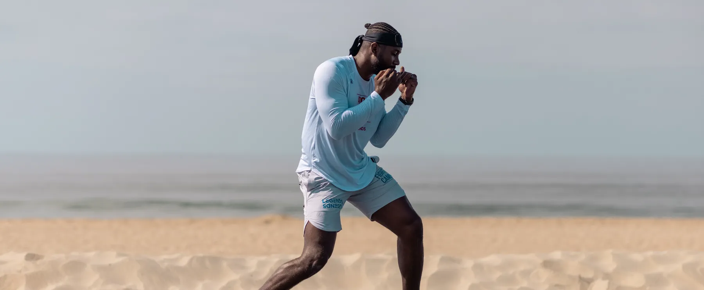
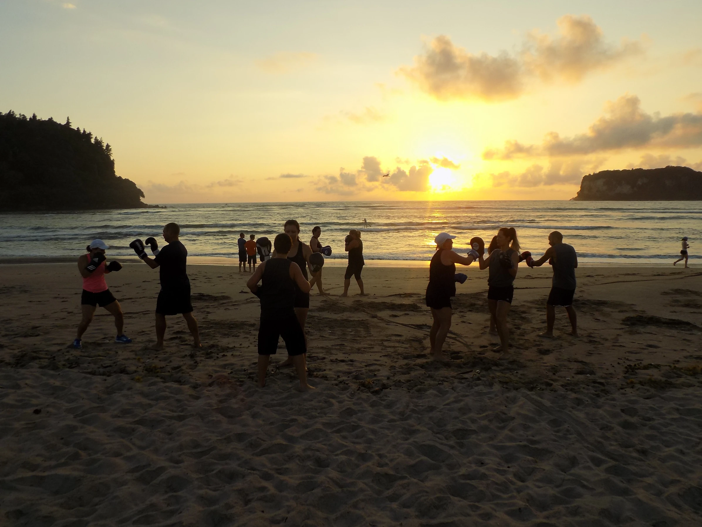

## Introduction

Are you tired of the same old gym routines? Are you seeking a fresh, invigorating approach to your fitness journey? Look no further than the picturesque beaches of Marbella, where the sun, sand, and sea meet the art of combat sports. In this article, we'll delve deeper into why training boxing, kickboxing, MMA, and more on the beach is not just a workout but an experience that can transform your fitness journey.

## Embrace the Serenity of the Seaside

Imagine standing on the shoreline, the gentle waves lapping at your feet as you prepare to embark on a training session like no other. The soothing sound of the ocean, coupled with the soft sand beneath your toes, creates an atmosphere of tranquility that enhances focus and concentration. Here, amidst the beauty of nature, you can fully immerse yourself in your training, leaving behind the distractions of everyday life.

## Escape the Conventional Gym Setting

Bid farewell to the monotonous walls of the gym and **embrace** the vast expanse of the beach as your training ground. With ample space to move freely and explore different techniques, the beach offers a dynamic environment that challenges both your body and mind. Whether you're shadowboxing in the sand or practicing kicks against the backdrop of the horizon, every session becomes an adventure filled with excitement and discovery.

## Connect with Nature

There's something truly magical about training amidst the elements. Feel the warmth of the sun on your skin, breathe in the salty sea air, and let the rhythm of the waves inspire and energize you. Training on the beach not only benefits your physical health but also nourishes your soul, allowing you to reconnect with the natural world and find balance in the midst of your busy life.

## Experience Versatile Training Opportunities

One of the greatest advantages of beach training is its versatility. From practicing striking combinations on the sand to engaging in agility drills in the shallows, the beach offers endless possibilities for creative and effective workouts. Whether you're a seasoned athlete or a beginner taking your first steps into the world of combat sports, training on the beach provides a unique and exhilarating experience that caters to all skill levels.

## Personalized Coaching in Paradise

Imagine having a dedicated coach by your side, guiding you through each session with expertise and encouragement. With personalized training programs tailored to your individual goals and abilities, you can make the most of your time on the beach and achieve remarkable results in a short period. Whether you're looking to improve your technique, build strength and endurance, or simply enjoy a fun and challenging workout, our experienced coaches are here to support you every step of the way.

## Conclusion

Training combat sports on the beach in Marbella is more than just a workout—it's an experience that can transform your fitness journey and elevate your overall well-being. From the serene surroundings to the versatile training opportunities, every aspect of beach training contributes to your physical, mental, and emotional health. So why settle for the ordinary when you can embrace the extraordinary and embark on a fitness adventure like no other? Join us on the beach and discover the power of training amidst the beauty of nature.
