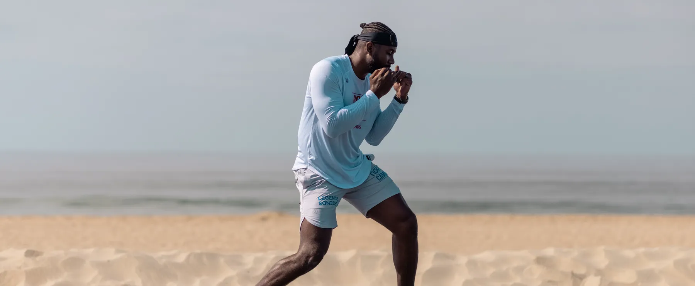

## Introducción

¿Estás cansado de las mismas rutinas de gimnasio? ¿Buscas un enfoque fresco y estimulante para tu viaje de fitness? No busques más allá de las pintorescas playas de Marbella, donde el sol, la arena y el mar se encuentran con el arte de los deportes de combate. En este artículo, profundizaremos en por qué entrenar boxeo, kickboxing, MMA y más en la playa no es solo un entrenamiento, sino una experiencia que puede transformar tu viaje de fitness.

## Acepta la serenidad del mar

Imagina estar de pie en la orilla, las suaves olas acariciando tus pies mientras te preparas para embarcarte en una sesión de entrenamiento como ninguna otra. El relajante sonido del océano, junto con la suave arena bajo tus pies, crea una atmósfera de tranquilidad que mejora el enfoque y la concentración. Aquí, en medio de la belleza de la naturaleza, puedes sumergirte por completo en tu entrenamiento, dejando atrás las distracciones de la vida cotidiana.

## Escapa del entorno convencional del gimnasio

Despídete de las monótonas paredes del gimnasio y **abrázate** a la vasta extensión de la playa como tu campo de entrenamiento. Con espacio amplio para moverte libremente y explorar diferentes técnicas, la playa ofrece un ambiente dinámico que desafía tanto tu cuerpo como tu mente. Ya sea que estés haciendo sombra en la arena o practicando patadas con el horizonte como telón de fondo, cada sesión se convierte en una aventura llena de emoción y descubrimiento.

## Conéctate con la naturaleza

Hay algo verdaderamente mágico en entrenar en medio de los elementos. Siente el calor del sol en tu piel, respira el aire salado del mar y deja que el ritmo de las olas te inspire y te energice. Entrenar en la playa no solo beneficia tu salud física, sino que también nutre tu alma, permitiéndote reconectar con el mundo natural y encontrar equilibrio en medio de tu vida ocupada.

## Experimenta oportunidades de entrenamiento versátiles

Una de las mayores ventajas del entrenamiento en la playa es su versatilidad. Desde practicar combinaciones de golpes en la arena hasta participar en ejercicios de agilidad en aguas poco profundas, la playa ofrece infinitas posibilidades para entrenamientos creativos y efectivos. Ya seas un atleta experimentado o un principiante dando tus primeros pasos en el mundo de los deportes de combate, entrenar en la playa proporciona una experiencia única y emocionante que se adapta a todos los niveles de habilidad.

## Entrenamiento personalizado en el paraíso

Imagina tener un entrenador dedicado a tu lado, guiándote en cada sesión con experiencia y aliento. Con programas de entrenamiento personalizados adaptados a tus objetivos y habilidades individuales, puedes aprovechar al máximo tu tiempo en la playa y lograr resultados notables en poco tiempo. Ya sea que busques mejorar tu técnica, desarrollar fuerza y resistencia, o simplemente disfrutar de un entrenamiento divertido y desafiante, nuestros entrenadores experimentados están aquí para apoyarte en cada paso del camino.

## Conclusión

Entrenar deportes de combate en la playa en Marbella no es solo un entrenamiento, es una experiencia que puede transformar tu viaje de fitness y elevar tu bienestar general. Desde los tranquilos alrededores hasta las versátiles oportunidades de entrenamiento, cada aspecto del entrenamiento en la playa contribuye a tu salud física, mental y emocional. Entonces, ¿por qué conformarse con lo ordinario cuando puedes abrazar lo extraordinario y embarcarte en una aventura de fitness como ninguna otra? Únete a nosotros en la playa y descubre el poder de entrenar en medio de la belleza de la naturaleza.
