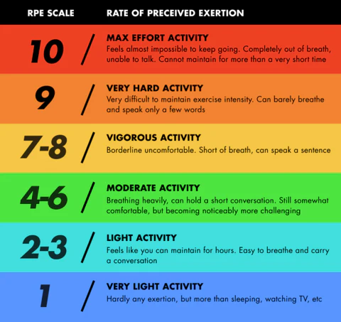

### One-Day-a-Week Full-Body Training Schedule

This training program consists of a one-day-a-week full-body workout routine. Each session includes one exercise from each of the following categories: Squat, Hip Hinge, Push, and Pull. The workout is structured into 4 rounds of 10-12 repetitions per exercise, with varying levels of intensity based on the Rate of Perceived Exertion (RPE).

### Rate of Perceived Exertion (RPE)
Rate of Perceived Exertion (RPE) is a subjective measure used to gauge the intensity of your exercise. It's typically assessed on a scale from 1 to 10, with 1 being very easy and 10 being maximum effort. Using RPE can help you adjust your workout intensity based on how you're feeling on a given day, ensuring you're working at an appropriate level for your goals and capabilities.

**Weekly Rotation:**
- Each week, the categories are rotated, starting with the second category from the previous week. This rotation ensures balanced muscle development and prevents monotony in the training routine.

### Exercise Selection for Each Round:
- **Round 1 (RPE 9)**: Choose one exercise from one category that challenges you close to your maximum effort.
- **Round 2 (RPE 7)**: Select exercises that still provide a challenge but allow for slightly more comfort and control *from the next category*.
- **Round 3 (RPE 5)**: Opt for exercises that you can perform with moderate effort, focusing on form and technique *from the next category*.
- **Round 4 (RPE 3)**: Choose exercises that are relatively easy and serve as a cooldown, promoting recovery *from the next category*.

By following this structured approach, you can effectively target all major muscle groups, progressively overload your muscles, and achieve balanced strength and fitness improvements over time.

---

### Squat
- **Back Squat**: Traditional squat with a barbell on the upper back. [YouTube Link]()
- **Goblet Squat**: Holding a kettlebell or dumbbell close to the chest while squatting. [YouTube Link]()
- **Front Squat**: Barbell positioned in front of the body, challenging core stability. [YouTube Link]()
- **Split Squat**: Lunging motion with one foot forward and one foot back. [YouTube Link]()
- **Box Squat**: Squatting onto a box or bench to control depth. [YouTube Link]()

---

### Hip Hinge
- **Deadlift**: Lifting a barbell from the ground using a hip hinge movement. [YouTube Link]()
- **Romanian Deadlift**: Similar to deadlift but with less knee bend and more focus on hip hinge. [YouTube Link]()
- **Kettlebell Swing**: Explosive hip hinge movement using a kettlebell. [YouTube Link]()
- **Good Morning**: Hinging forward at the hips while holding a barbell on the upper back. [YouTube Link]()
- **Single-Leg Romanian Deadlift**: Performing a hip hinge movement on one leg while holding a weight. [YouTube Link]()

---

### Push
- **Bench Press**: Pressing a barbell or dumbbells away from the chest while lying on a bench. [YouTube Link]()
- **Push-Up**: Bodyweight exercise where you push your body away from the ground. [YouTube Link]()
- **Overhead Press**: Pressing a barbell or dumbbells overhead while standing. [YouTube Link]()
- **Dumbbell Shoulder Press**: Overhead press using dumbbells for greater range of motion. [YouTube Link]()
- **Incline Bench Press**: Pressing on an incline bench to target upper chest. [YouTube Link]()

---

### Pull
- **Pull-Up**: Pulling your body upward until your chin reaches or clears the bar. [YouTube Link]()
- **Bent Over Row**: Rowing a barbell or dumbbells towards the lower chest while bent over. [YouTube Link]()
- **Lat Pulldown**: Pulling a bar down towards the chest while seated. [YouTube Link]()
- **Inverted Row**: Bodyweight rowing exercise using a bar at waist height. [YouTube Link]()
- **Face Pull**: Pulling resistance bands or cables towards the face to work the rear deltoids. [YouTube Link]()

